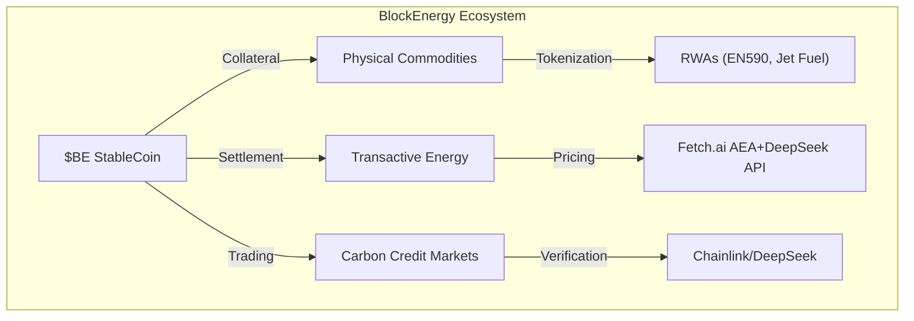
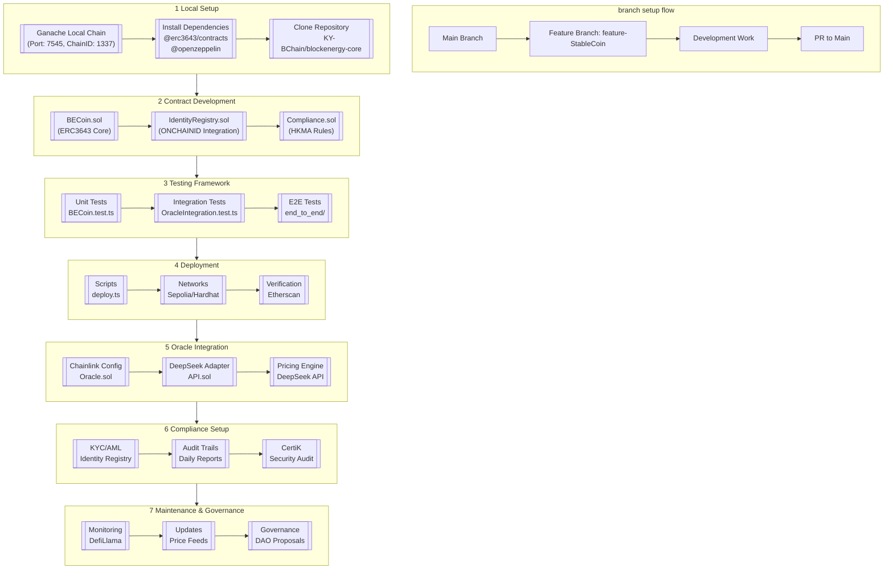
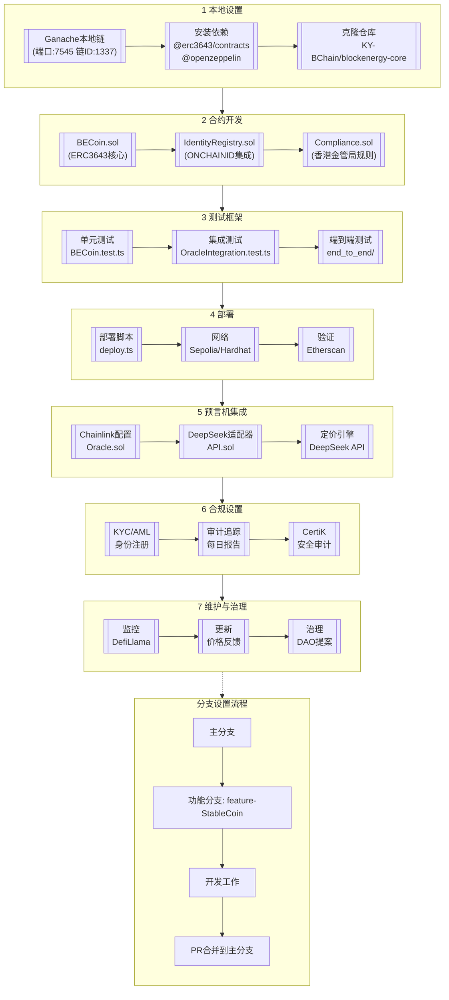

# BlockEnergy Core Platform

[](https://opensource.org/licenses/Apache-2.0)
[](https://erc3643.org)
[](https://www.hkma.gov.hk)

> **Next-Generation DeFi with AI Platform for Regulated Commodities / Energy Pricing and Trading & Finance Finance**


## 🌍 Project Overview

BlockEnergy revolutionises **commodities trading** and **energy finance** through a regulated DeFi ecosystem, combining:

- **$BE Hybrid StableCoin**: Multi-asset collateralized digital currency
- **Commodities DEX**: EN590 diesel, jet fuel, renewables, carbon-credits, and carbon markets
- **Transactive Energy Grids**: AI-driven microgrid energy pricing & trading


## 🏦 BlockEnergy Structure
```bash
blockenergy-core/
├── stablecoin/                     # StableCoin Module
│   ├── contracts/                  # Solidity Contracts
│   │   ├── BECoin.sol             # ERC3643 StableCoin
│   │   ├── compliance/            # Compliance Logic
│   │   │   ├── IdentityRegistry.sol
│   │   │   └── Compliance.sol
│   │   ├── oracles/               # Oracle Integration
│   │   │   ├── ChainlinkOracle.sol
│   │   │   └── DeepSeekAdapter.sol
│   │   └── utils/                 # Utilities
│   │       └── TokenMath.sol
│   ├── scripts/                   # Deployment & Interaction
│   │   ├── deploy.ts              # Hardhat/Truffle Scripts
│   │   └── update_oracle.ts       # Oracle Config
│   ├── tests/                     # Test Suites
│   │   ├── unit/                  # Unit Tests
│   │   │   ├── BECoin.test.ts
│   │   │   └── Compliance.test.ts
│   │   └── integration/           # Integration Tests
│   │       └── OracleIntegration.test.ts
│   └── docs/                      # Technical Documentation
│       ├── ARCHITECTURE.md        # System Design
│       ├── AUDIT.md               # Security Audit Reports
│       └── COMPLIANCE.md          # HKMA Regulatory Alignment
│
├── pricing_engine/                # Pricing Engine Module
│   ├── contracts/                 # On-Chain Components
│   │   └── DeepSeekConnector.sol # API Integration
│   ├── scripts/                   # Data Fetching
│   │   └── fetch_prices.py        # DeepSeek API Scripts
│   ├── tests/
│   │   └── pricing.test.ts        # Price Feed Tests
│   └── docs/
│       └── PRICING_LOGIC.md       # Algorithm Details
│
├── transactive_energy/            # Energy Trading Module (Future)
│   └── ...                       # (Structure similar to stablecoin/)
│
├── mermaid/                       # Architecture Diagrams
│   └── stablecoin_flow.mmd        # Mermaid System Flow
│
├── docs/                          # Global Documentation
│   ├── OVERVIEW.md               # Project Vision
│   ├── ONBOARDING.md             # Developer Setup
│   └── LICENSES.md              # Apache 2.0 / Commercial
│
├── scripts/                       # Global Scripts
│   ├── ganache-setup.sh          # Local Testnet Config
│   └── fleek-ipfs-deploy.sh      # Fleek Hosting
│
├── test/                          # Cross-Module Tests
│   └── end_to_end/               # Full Workflow Tests
│
└── contracts/                     # Shared Contracts
    └── Interfaces/               # Common Interfaces
        ├── IERC3643.sol
        └── IOracle.sol

```

## 🏦 $BE StableCoin Architecture

### Key Features

| Component                | Specification                          | Regulatory Alignment       |
|--------------------------|----------------------------------------|----------------------------|
| **Collateral Basket**    | 80% CBDCs (eCNY,eHKD,eEUR), 20% RWAs  | MiCA Art. 23, HKMA VASP    |
| **Pricing Engine**       | DeepSeek API + Chainlink Oracles       | ESMA Market Abuse Reg      |
| **Identity Layer**       | ERC-3643 + ONCHAINID                   | GDPR, HKMA KYC/AML         |
| **Settlement**           | IPSF via Fleek/IPFS                    | EU DLT Pilot Regime         |

%% $BE StableCoin Architecture - Horizontal Subgraphs


%% BE稳定币架构 - 水平子图布局


## 🛠️ Technical Implementation

### Core Components

1. **Smart Contracts**
   ```bash
   blockenergy-core/
   └── stablecoin/
       └── contracts/
           ├── BECoin.sol             # ERC-3643 Core
           ├── compliance/           # KYC/AML Rules
           ├── oracles/              # Price Feeds
           └── utils/                # Token Math
   ```

2. **Pricing Infrastructure**
   ```python
   # pricing_engine/aea/price_feed/skills/pricing
   def calculate_basket_value():
       # DeepSeek API integration
       diesel_price = get_en590_price()
       solar_price = get_platts_solar()
       return (diesel_price * 0.4) + (solar_price * 0.6)
   ```

## 🚀 Getting Started

### Installation

```bash
git clone https://github.com/KY-BChain/blockenergy-core.git
cd blockenergy-core
npm install -D hardhat @openzeppelin/contracts @erc3643/contracts
```

### Local Deployment (Ganache)

1. **Start Ganache Desktop**
   - Workspace: `BlockEnergyLocalTest`
   - Chain ID: `1337`
   - Port: `7545`

2. **Deploy Contracts**
   ```bash
   npx hardhat run stablecoin/scripts/deploy.ts --network ganache
   ```

### Testing Framework

```typescript
// Sample Unit Test
describe("EN590 Trading", () => {
  it("Should settle diesel trade in $BE", async () => {
    const tx = await dex.tradeEN590(1000, "0xBuyer");
    await expect(tx).to.emit("TradeSettled");
  });
});
```

## 📜 Regulatory Compliance

| Jurisdiction | Standard                  | Implementation                          |
|--------------|---------------------------|-----------------------------------------|
| **EU**       | Markets in Crypto Assets  | ERC-3643 identity hooks                 |
| **HKSAR**    | VASP Framework            | Daily reserve audits                    |
| **UN**       | Paris Agreement           | Carbon credit retirement tracking       |

## 🌐 Roadmap

| Quarter      | Milestone                         |
|--------------|-----------------------------------|
| Q3 2024      | eCNY/eHKD Collateral Pool Launch  |
| Q1 2025      | EN590 Diesel Trading Module       |
| Q3 2025      | Transactive Energy Integration    |

## 🤝 Contributing

1. Fork `blockenergy-public`
2. Create feature branch: `git checkout -b feat/en590-trading`
3. Submit PR with [KYBChain CLA](https://kybchain.org/cla)

## 📄 License

Apache 2.0 - See [LICENSE](LICENSE)

---

**Contact**: dev@blockenergy.net | [BlockEnergy White Paper](https://blockenergy.net/whitepaper)
